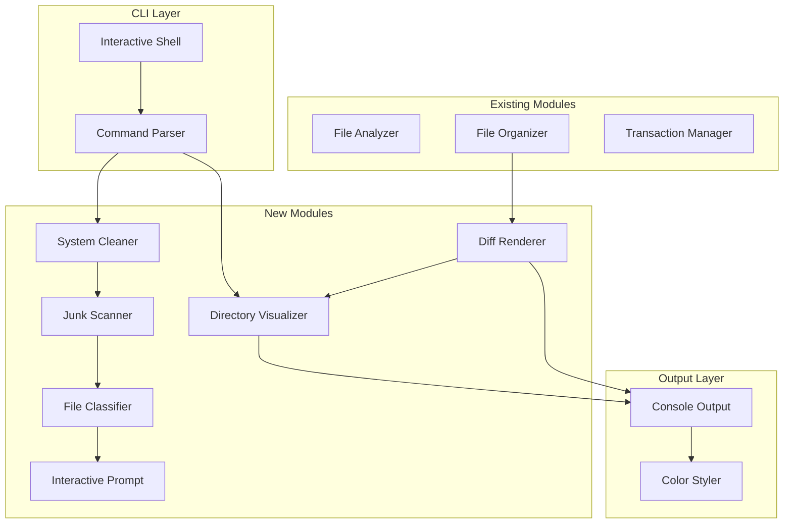

# Design Document: Enhanced Output & System Cleanup

## Overview

本设计扩展 Cleanup CLI，增加三个核心模块：

1. **Directory Visualizer** - 目录结构可视化，支持树形展示和颜色区分
2. **Diff Renderer** - 操作前后对比显示，高亮变化内容
3. **System Cleaner** - 系统垃圾扫描与清理，支持 macOS 和 Windows

系统采用模块化设计，新增组件与现有架构无缝集成。

## Architecture



## Components and Interfaces

### 1. Console Output (控制台输出模块)

```go
// internal/output/console.go
package output

// ColorSupport represents terminal color capability
type ColorSupport int

const (
    ColorNone    ColorSupport = iota // No color support
    ColorBasic                        // Basic 16 colors
    ColorFull                         // Full 256/true color
)

// Console handles all terminal output with color support
type Console struct {
    colorEnabled bool
    colorSupport ColorSupport
    writer       io.Writer
}

// NewConsole creates a new console output handler
func NewConsole(writer io.Writer) *Console

// DetectColorSupport detects terminal color capability
func (c *Console) DetectColorSupport() ColorSupport

// SetColorEnabled enables or disables color output
func (c *Console) SetColorEnabled(enabled bool)

// Success prints a success message with green ✓
func (c *Console) Success(format string, args ...interface{})

// Error prints an error message with red ✗
func (c *Console) Error(format string, args ...interface{})

// Warning prints a warning message with yellow ⚠
func (c *Console) Warning(format string, args ...interface{})

// Info prints an info message
func (c *Console) Info(format string, args ...interface{})

// Box prints content in a bordered box
func (c *Console) Box(title string, content []string)

// Table prints data in a formatted table
func (c *Console) Table(headers []string, rows [][]string)
```

### 2. Color Styler (颜色样式模块)

```go
// internal/output/style.go
package output

// Style represents text styling options
type Style struct {
    FgColor    Color
    BgColor    Color
    Bold       bool
    Italic     bool
    Underline  bool
}

// Color represents ANSI color codes
type Color int

const (
    ColorDefault Color = iota
    ColorBlack
    ColorRed
    ColorGreen
    ColorYellow
    ColorBlue
    ColorMagenta
    ColorCyan
    ColorWhite
)

// Styler handles text styling with ANSI codes
type Styler struct {
    enabled bool
}

// NewStyler creates a new styler
func NewStyler(enabled bool) *Styler

// Apply applies style to text
func (s *Styler) Apply(text string, style Style) string

// Red returns red colored text
func (s *Styler) Red(text string) string

// Green returns green colored text
func (s *Styler) Green(text string) string

// Yellow returns yellow colored text
func (s *Styler) Yellow(text string) string

// Blue returns blue colored text
func (s *Styler) Blue(text string) string

// Bold returns bold text
func (s *Styler) Bold(text string) string

// Dim returns dimmed text
func (s *Styler) Dim(text string) string
```

### 3. Directory Visualizer (目录可视化模块)

```go
// internal/visualizer/tree.go
package visualizer

// TreeNode represents a node in the directory tree
type TreeNode struct {
    Name     string
    Path     string
    IsDir    bool
    Size     int64
    Children []*TreeNode
    Depth    int
}

// TreeOptions configures tree rendering
type TreeOptions struct {
    MaxDepth      int    // Maximum depth to display (0 = unlimited)
    ShowSize      bool   // Show file sizes
    ShowHidden    bool   // Show hidden files
    UseColor      bool   // Use ANSI colors
    UseUnicode    bool   // Use Unicode box characters
    IndentSize    int    // Spaces per indent level
}

// TreeVisualizer renders directory trees
type TreeVisualizer struct {
    console *output.Console
    styler  *output.Styler
    options *TreeOptions
}

// NewTreeVisualizer creates a new tree visualizer
func NewTreeVisualizer(console *output.Console, options *TreeOptions) *TreeVisualizer

// BuildTree builds a tree structure from a directory path
func (v *TreeVisualizer) BuildTree(path string) (*TreeNode, error)

// Render renders a tree node to string
func (v *TreeVisualizer) Render(node *TreeNode) string

// RenderToWriter renders a tree node to an io.Writer
func (v *TreeVisualizer) RenderToWriter(node *TreeNode, w io.Writer) error

// Branch characters for tree rendering
const (
    BranchVertical   = "│"
    BranchHorizontal = "──"
    BranchCorner     = "└"
    BranchTee        = "├"
    BranchEmpty      = "   "

    // ASCII fallback
    BranchVerticalASCII   = "|"
    BranchHorizontalASCII = "--"
    BranchCornerASCII     = "`"
    BranchTeeASCII        = "+"
)
```

### 4. Diff Renderer (差异渲染模块)

```go
// internal/visualizer/diff.go
package visualizer

// DiffType represents the type of change
type DiffType int

const (
    DiffUnchanged DiffType = iota
    DiffAdded
    DiffRemoved
    DiffMoved
    DiffRenamed
)

// DiffEntry represents a single diff entry
type DiffEntry struct {
    Type       DiffType
    Path       string
    NewPath    string  // For moved/renamed files
    Size       int64
    IsDir      bool
}

// DiffResult represents the result of comparing two directory states
type DiffResult struct {
    Entries     []*DiffEntry
    AddedCount  int
    RemovedCount int
    MovedCount  int
    RenamedCount int
    TotalSize   int64
}

// DiffRenderer renders directory diffs
type DiffRenderer struct {
    console *output.Console
    styler  *output.Styler
    tree    *TreeVisualizer
}

// NewDiffRenderer creates a new diff renderer
func NewDiffRenderer(console *output.Console) *DiffRenderer

// CaptureState captures the current state of a directory
func (r *DiffRenderer) CaptureState(path string) (*TreeNode, error)

// Compare compares two directory states
func (r *DiffRenderer) Compare(before, after *TreeNode) *DiffResult

// Render renders a diff result
func (r *DiffRenderer) Render(result *DiffResult) string

// RenderSideBySide renders before/after trees side by side
func (r *DiffRenderer) RenderSideBySide(before, after *TreeNode, diff *DiffResult) string

// RenderSummary renders a summary of changes
func (r *DiffRenderer) RenderSummary(result *DiffResult) string

// Symbols for diff display
const (
    SymbolAdded   = "+"
    SymbolRemoved = "-"
    SymbolMoved   = "→"
    SymbolRenamed = "~"
)
```

### 5. Junk Scanner (垃圾扫描模块)

```go
// internal/cleaner/scanner.go
package cleaner

// JunkCategory represents a category of junk files
type JunkCategory string

const (
    CategoryCache     JunkCategory = "cache"
    CategoryLogs      JunkCategory = "logs"
    CategoryTemp      JunkCategory = "temp"
    CategoryTrash     JunkCategory = "trash"
    CategoryBrowser   JunkCategory = "browser"
    CategoryDeveloper JunkCategory = "developer"
    CategorySystem    JunkCategory = "system"
)

// JunkLocation represents a junk file location
type JunkLocation struct {
    Path        string
    Category    JunkCategory
    Description string
    Platform    string  // "darwin", "windows", "all"
    Pattern     string  // Optional glob pattern
}

// JunkFile represents a detected junk file
type JunkFile struct {
    Path        string
    Size        int64
    Category    JunkCategory
    ModTime     time.Time
    IsImportant bool  // If true, requires confirmation
}

// ScanResult represents the result of a junk scan
type ScanResult struct {
    Files       []*JunkFile
    TotalSize   int64
    ByCategory  map[JunkCategory][]*JunkFile
    Skipped     []string  // Paths skipped due to permissions
    Errors      []error
}

// JunkScanner scans for junk files
type JunkScanner struct {
    locations   []*JunkLocation
    classifier  *FileClassifier
    platform    string
}

// NewJunkScanner creates a new junk scanner
func NewJunkScanner() *JunkScanner

// AddLocation adds a custom junk location
func (s *JunkScanner) AddLocation(loc *JunkLocation)

// Scan scans for junk files
func (s *JunkScanner) Scan(ctx context.Context) (*ScanResult, error)

// ScanCategory scans only a specific category
func (s *JunkScanner) ScanCategory(ctx context.Context, category JunkCategory) (*ScanResult, error)

// GetDefaultLocations returns default junk locations for current platform
func (s *JunkScanner) GetDefaultLocations() []*JunkLocation
```

### 6. System Cleaner (系统清理模块)

```go
// internal/cleaner/cleaner.go
package cleaner

// CleanOptions configures cleanup behavior
type CleanOptions struct {
    DryRun       bool           // Preview only, don't delete
    Force        bool           // Permanently delete instead of trash
    Categories   []JunkCategory // Categories to clean (empty = all)
    Interactive  bool           // Prompt for uncertain files
    TrashPath    string         // Custom trash directory
}

// CleanResult represents the result of a cleanup operation
type CleanResult struct {
    Cleaned     []*JunkFile
    Skipped     []*JunkFile
    Failed      []*JunkFile
    SpaceFreed  int64
    Errors      []error
}

// SystemCleaner handles system junk cleanup
type SystemCleaner struct {
    scanner     *JunkScanner
    classifier  *FileClassifier
    prompt      *InteractivePrompt
    console     *output.Console
    txnManager  *transaction.Manager
}

// NewSystemCleaner creates a new system cleaner
func NewSystemCleaner(txnManager *transaction.Manager) *SystemCleaner

// Preview shows what would be cleaned without actually cleaning
func (c *SystemCleaner) Preview(ctx context.Context, opts *CleanOptions) (*ScanResult, error)

// Clean performs the cleanup operation
func (c *SystemCleaner) Clean(ctx context.Context, opts *CleanOptions) (*CleanResult, error)

// CleanCategory cleans only a specific category
func (c *SystemCleaner) CleanCategory(ctx context.Context, category JunkCategory, opts *CleanOptions) (*CleanResult, error)
```

### 7. File Classifier (文件分类器)

```go
// internal/cleaner/classifier.go
package cleaner

// FileImportance represents the importance level of a file
type FileImportance int

const (
    ImportanceNormal FileImportance = iota
    ImportanceImportant
    ImportanceCritical
    ImportanceUncertain
)

// ImportantPattern represents a pattern for important files
type ImportantPattern struct {
    Pattern     string  // Glob or regex pattern
    Type        string  // "name", "path", "extension"
    Importance  FileImportance
    Description string
}

// ClassificationResult represents the result of classifying a file
type ClassificationResult struct {
    Path        string
    Importance  FileImportance
    Reason      string
    Patterns    []string  // Matched patterns
}

// FileClassifier classifies files by importance
type FileClassifier struct {
    patterns    []*ImportantPattern
    sizeThreshold int64
    recentDays  int
}

// NewFileClassifier creates a new file classifier
func NewFileClassifier() *FileClassifier

// AddPattern adds a custom important file pattern
func (c *FileClassifier) AddPattern(pattern *ImportantPattern)

// Classify classifies a file's importance
func (c *FileClassifier) Classify(path string, info os.FileInfo) *ClassificationResult

// IsImportant returns true if the file is important
func (c *FileClassifier) IsImportant(path string) bool

// IsUncertain returns true if the file's safety is uncertain
func (c *FileClassifier) IsUncertain(path string) bool

// GetDefaultPatterns returns default important file patterns
func (c *FileClassifier) GetDefaultPatterns() []*ImportantPattern
```

### 8. Interactive Prompt (交互式提示模块)

```go
// internal/cleaner/prompt.go
package cleaner

// PromptAction represents user's choice
type PromptAction int

const (
    ActionYes PromptAction = iota
    ActionNo
    ActionAllYes
    ActionSkipAll
    ActionView
)

// PromptOptions configures prompt behavior
type PromptOptions struct {
    Timeout     time.Duration  // Timeout for response (0 = no timeout)
    DefaultAction PromptAction // Default action on timeout
}

// FilePrompt represents a prompt for a single file
type FilePrompt struct {
    Path        string
    Size        int64
    Type        string
    ModTime     time.Time
    Preview     string  // First 500 chars for text files
    Reason      string  // Why confirmation is needed
}

// InteractivePrompt handles user confirmation prompts
type InteractivePrompt struct {
    console     *output.Console
    reader      io.Reader
    options     *PromptOptions
    allYes      bool  // User selected "All yes"
    skipAll     bool  // User selected "Skip all"
}

// NewInteractivePrompt creates a new interactive prompt
func NewInteractivePrompt(console *output.Console, reader io.Reader) *InteractivePrompt

// Prompt prompts the user for a single file
func (p *InteractivePrompt) Prompt(file *FilePrompt) (PromptAction, error)

// PromptBatch prompts for multiple files with batch options
func (p *InteractivePrompt) PromptBatch(files []*FilePrompt) (map[string]PromptAction, error)

// ShowPreview shows file content preview
func (p *InteractivePrompt) ShowPreview(path string, maxChars int) error

// Reset resets the batch state (allYes, skipAll)
func (p *InteractivePrompt) Reset()
```

## Data Models

### Platform-Specific Junk Locations

```go
// macOS junk locations
var macOSJunkLocations = []*JunkLocation{
    {Path: "~/Library/Caches", Category: CategoryCache, Platform: "darwin"},
    {Path: "~/.cache", Category: CategoryCache, Platform: "darwin"},
    {Path: "~/Library/Logs", Category: CategoryLogs, Platform: "darwin"},
    {Path: "/var/log", Category: CategoryLogs, Platform: "darwin"},
    {Path: "/tmp", Category: CategoryTemp, Platform: "darwin"},
    {Path: "/var/tmp", Category: CategoryTemp, Platform: "darwin"},
    {Path: "~/.Trash", Category: CategoryTrash, Platform: "darwin"},
    {Path: "~/Library/Developer/Xcode/DerivedData", Category: CategoryDeveloper, Platform: "darwin"},
    {Path: "~/Library/Application Support/MobileSync/Backup", Category: CategoryDeveloper, Platform: "darwin"},
    {Path: "~/Library/Caches/com.apple.Safari", Category: CategoryBrowser, Platform: "darwin"},
    {Path: "~/Library/Caches/Google/Chrome", Category: CategoryBrowser, Platform: "darwin"},
    {Path: "~/Library/Caches/Firefox", Category: CategoryBrowser, Platform: "darwin"},
}

// Windows junk locations
var windowsJunkLocations = []*JunkLocation{
    {Path: "%TEMP%", Category: CategoryTemp, Platform: "windows"},
    {Path: "%TMP%", Category: CategoryTemp, Platform: "windows"},
    {Path: "C:\\Windows\\Temp", Category: CategoryTemp, Platform: "windows"},
    {Path: "C:\\Windows\\Prefetch", Category: CategorySystem, Platform: "windows"},
    {Path: "%LOCALAPPDATA%\\Microsoft\\Windows\\Explorer", Category: CategoryCache, Platform: "windows"},
    {Path: "C:\\Windows\\SoftwareDistribution\\Download", Category: CategorySystem, Platform: "windows"},
    {Path: "%LOCALAPPDATA%\\Google\\Chrome\\User Data\\Default\\Cache", Category: CategoryBrowser, Platform: "windows"},
    {Path: "%LOCALAPPDATA%\\Mozilla\\Firefox\\Profiles\\*\\cache2", Category: CategoryBrowser, Platform: "windows"},
    {Path: "%LOCALAPPDATA%\\Microsoft\\Edge\\User Data\\Default\\Cache", Category: CategoryBrowser, Platform: "windows"},
}
```

### Default Important File Patterns

```go
var defaultImportantPatterns = []*ImportantPattern{
    // Security files
    {Pattern: "*.key", Type: "extension", Importance: ImportanceCritical, Description: "Private key file"},
    {Pattern: "*.pem", Type: "extension", Importance: ImportanceCritical, Description: "Certificate file"},
    {Pattern: "*.p12", Type: "extension", Importance: ImportanceCritical, Description: "PKCS12 certificate"},
    {Pattern: "id_rsa*", Type: "name", Importance: ImportanceCritical, Description: "SSH private key"},
    {Pattern: "id_ed25519*", Type: "name", Importance: ImportanceCritical, Description: "SSH private key"},

    // Configuration files
    {Pattern: ".env*", Type: "name", Importance: ImportanceImportant, Description: "Environment config"},
    {Pattern: "*.credentials", Type: "extension", Importance: ImportanceCritical, Description: "Credentials file"},
    {Pattern: "config.yaml", Type: "name", Importance: ImportanceImportant, Description: "Configuration file"},
    {Pattern: "secrets.*", Type: "name", Importance: ImportanceCritical, Description: "Secrets file"},

    // Important directories
    {Pattern: "*/Documents/*", Type: "path", Importance: ImportanceImportant, Description: "Documents folder"},
    {Pattern: "*/Desktop/*", Type: "path", Importance: ImportanceImportant, Description: "Desktop folder"},
    {Pattern: "*backup*", Type: "path", Importance: ImportanceImportant, Description: "Backup file"},
}
```

### Configuration Extension

```yaml
# .cleanuprc.yaml additions
output:
  colorEnabled: true
  unicodeEnabled: true
  maxTreeDepth: 5
  showDiffAfterOrganize: true

cleaner:
  trashPath: ~/.cleanup/trash
  defaultCategories:
    - cache
    - temp
    - logs
  customLocations:
    - path: ~/custom/cache
      category: cache
      description: "Custom cache directory"

  importantPatterns:
    - pattern: "*.important"
      type: extension
      importance: important
      description: "Custom important files"

  prompt:
    timeout: 30s
    defaultAction: skip
```

## Correctness Properties

_A property is a characteristic or behavior that should hold true across all valid executions of a system-essentially, a formal statement about what the system should do._

### Property 1: Tree Rendering Structure Correctness

_For any_ valid directory structure, the rendered tree output SHALL contain proper branch characters (├── └── │) with correct indentation levels matching the directory depth.

**Validates: Requirements 1.1, 1.2**

### Property 2: Tree Depth Limiting

_For any_ directory structure with depth greater than maxDepth, the rendered tree SHALL only display nodes up to maxDepth levels, with no nodes beyond that depth appearing in the output.

**Validates: Requirements 1.5**

### Property 3: Diff State Capture Round-Trip

_For any_ directory state, capturing the state before and after an operation SHALL produce accurate TreeNode representations that, when compared, correctly identify all changes.

**Validates: Requirements 2.1, 2.2**

### Property 4: Diff Highlighting Correctness

_For any_ diff result containing added, removed, or moved files, the rendered output SHALL contain the correct color codes and symbols (green/+, red/-, yellow/→) for each change type.

**Validates: Requirements 2.3, 2.4, 2.5**

### Property 5: Diff Summary Accuracy

_For any_ diff result, the summary counts (added, removed, moved, renamed) SHALL exactly match the number of entries of each type in the diff entries list.

**Validates: Requirements 2.7**

### Property 6: Message Type Styling

_For any_ success, error, or warning message, the output SHALL contain the appropriate ANSI color codes (green/red/yellow) and symbols (✓/✗/⚠) when color is enabled.

**Validates: Requirements 3.3, 3.4, 3.5**

### Property 7: Color Fallback

_For any_ output when color is disabled, the rendered text SHALL contain no ANSI escape sequences (no \x1b[ codes).

**Validates: Requirements 3.1, 3.7**

### Property 8: Platform-Specific Junk Detection

_For any_ junk file in a platform-specific location (macOS or Windows), the scanner SHALL correctly identify and categorize the file according to the platform's junk location definitions.

**Validates: Requirements 4.1, 4.2**

### Property 9: Junk Size Calculation

_For any_ scan result, the total size SHALL equal the sum of all individual file sizes in the result.

**Validates: Requirements 4.3**

### Property 10: Junk Categorization

_For any_ detected junk file, the file SHALL be assigned to exactly one category based on its location, and the category SHALL match the location's defined category.

**Validates: Requirements 4.4**

### Property 11: Trash vs Permanent Delete

_For any_ cleanup operation without --force flag, cleaned files SHALL be moved to the trash directory rather than permanently deleted, and the original path SHALL no longer exist.

**Validates: Requirements 5.3**

### Property 12: Force Delete Behavior

_For any_ cleanup operation with --force flag, cleaned files SHALL be permanently deleted (not in trash), and neither the original path nor a trash copy SHALL exist.

**Validates: Requirements 5.4**

### Property 13: Space Freed Calculation

_For any_ cleanup result, the space freed value SHALL equal the sum of sizes of all successfully cleaned files.

**Validates: Requirements 5.5**

### Property 14: Error Resilience

_For any_ batch cleanup where some files fail, the successful files SHALL be cleaned and the failed files SHALL be recorded in the errors list, with cleanup continuing for remaining files.

**Validates: Requirements 5.6**

### Property 15: Important File Classification

_For any_ file matching an important pattern (_.key, _.pem, .env\*, etc.), the classifier SHALL return ImportanceImportant or ImportanceCritical, never ImportanceNormal.

**Validates: Requirements 6.1**

### Property 16: Important File Exclusion

_For any_ junk scan result, files classified as important SHALL NOT appear in the cleanup list unless explicitly overridden.

**Validates: Requirements 6.5**

### Property 17: File Preview Length

_For any_ text file preview, the preview content SHALL be at most 500 characters, truncated if the file is longer.

**Validates: Requirements 7.4**

### Property 18: All Yes Behavior

_For any_ prompt session where user selects "All yes", all subsequent uncertain files in that session SHALL be processed without additional prompts.

**Validates: Requirements 7.5**

### Property 19: Skip All Behavior

_For any_ prompt session where user selects "Skip all", all subsequent uncertain files in that session SHALL be skipped without additional prompts.

**Validates: Requirements 7.6**

### Property 20: Non-Interactive Mode

_For any_ uncertain file when running with --yes flag (non-interactive mode), the file SHALL be skipped by default without prompting.

**Validates: Requirements 7.7**

### Property 21: Platform Path Separator

_For any_ displayed path, the path separator SHALL match the current operating system (/ for macOS/Linux, \ for Windows).

**Validates: Requirements 8.4**

### Property 22: Unicode Fallback

_For any_ tree rendering when Unicode is disabled, the output SHALL use ASCII fallback characters (|, --, +, `) instead of Unicode box-drawing characters.

**Validates: Requirements 8.6**

## Error Handling

### Error Types

```go
// internal/cleaner/errors.go
package cleaner

type CleanerError struct {
    Code        string
    Message     string
    Path        string
    Recoverable bool
}

const (
    ErrPermissionDenied  = "PERMISSION_DENIED"
    ErrFileNotFound      = "FILE_NOT_FOUND"
    ErrPathProtected     = "PATH_PROTECTED"
    ErrDiskFull          = "DISK_FULL"
    ErrInvalidPattern    = "INVALID_PATTERN"
    ErrScanTimeout       = "SCAN_TIMEOUT"
)
```

### Error Categories

1. **Permission Errors** → Skip file, log warning, continue
2. **Protected Path Errors** → Skip silently (SIP on macOS)
3. **Disk Full Errors** → Stop cleanup, report error
4. **Pattern Errors** → Log warning, skip pattern

## Testing Strategy

### Unit Tests

使用 Go 标准 testing 包：

- **Tree rendering**: Various directory structures, edge cases
- **Diff calculation**: Added/removed/moved file detection
- **Color output**: ANSI code generation, fallback behavior
- **Pattern matching**: Important file patterns, junk patterns
- **Platform detection**: OS-specific path handling

### Property-Based Tests

使用 [rapid](https://github.com/flyingmutant/rapid) 库：

- **Minimum 100 iterations per property test**
- **Each test tagged with**: `Feature: enhanced-output-cleanup, Property N: {property_text}`

```go
func TestTreeDepthLimiting(t *testing.T) {
    // Feature: enhanced-output-cleanup, Property 2: Tree Depth Limiting
    rapid.Check(t, func(t *rapid.T) {
        maxDepth := rapid.IntRange(1, 10).Draw(t, "maxDepth")
        actualDepth := rapid.IntRange(maxDepth+1, 20).Draw(t, "actualDepth")
        // ... test logic
    })
}

func TestDiffSummaryAccuracy(t *testing.T) {
    // Feature: enhanced-output-cleanup, Property 5: Diff Summary Accuracy
    rapid.Check(t, func(t *rapid.T) {
        addedCount := rapid.IntRange(0, 100).Draw(t, "added")
        removedCount := rapid.IntRange(0, 100).Draw(t, "removed")
        // ... test logic
    })
}
```

### Integration Tests

- Full cleanup workflow with temp directories
- Cross-platform path handling
- Interactive prompt simulation
- Transaction rollback for cleanup operations

### Test Dependencies

```go
// go.mod additions
require (
    github.com/flyingmutant/rapid v1.1.0  // Property testing
    github.com/stretchr/testify v1.8.4    // Assertions
)
```
